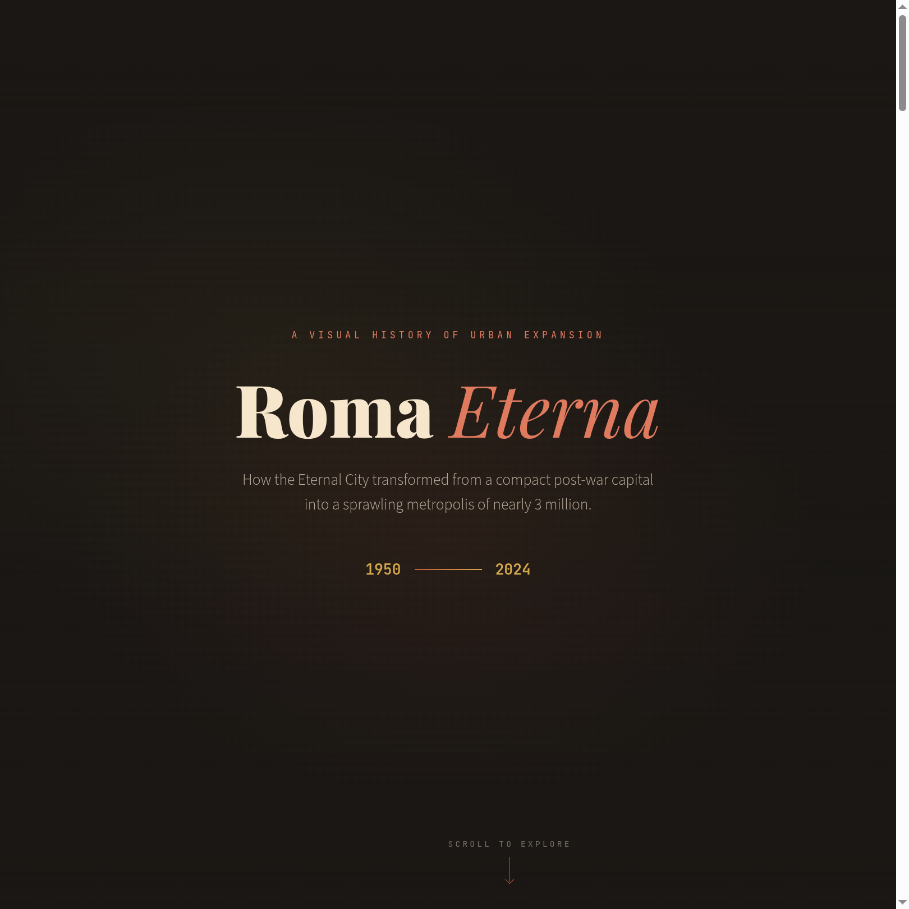
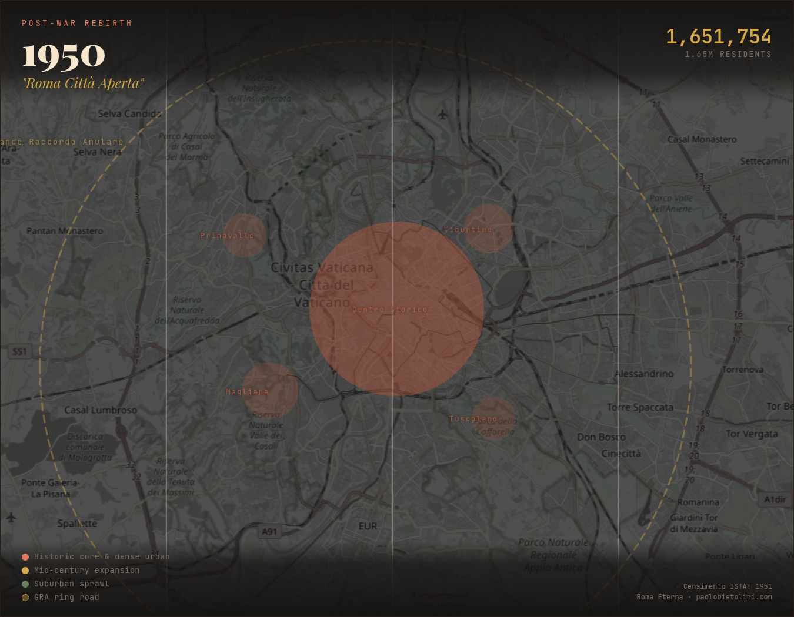
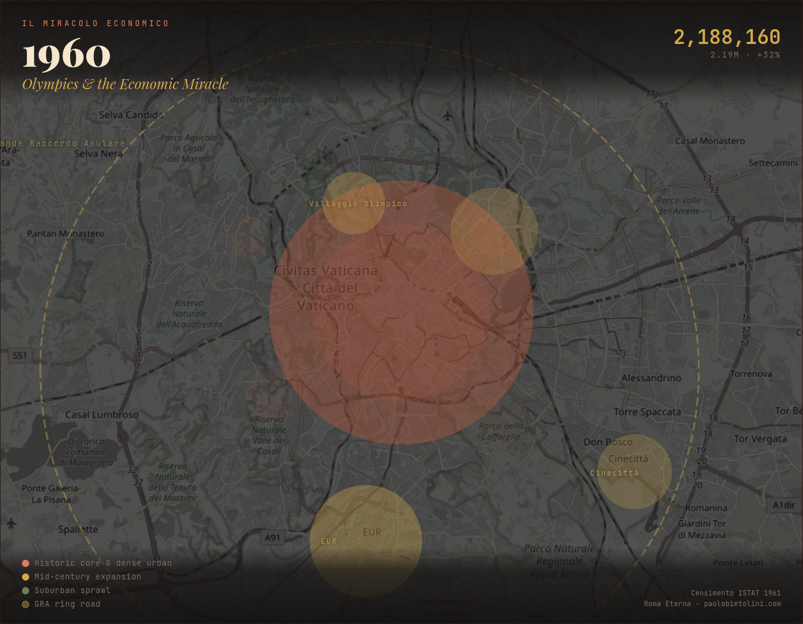
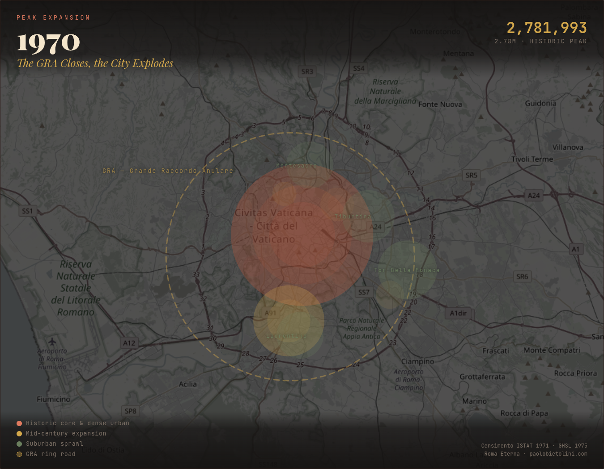
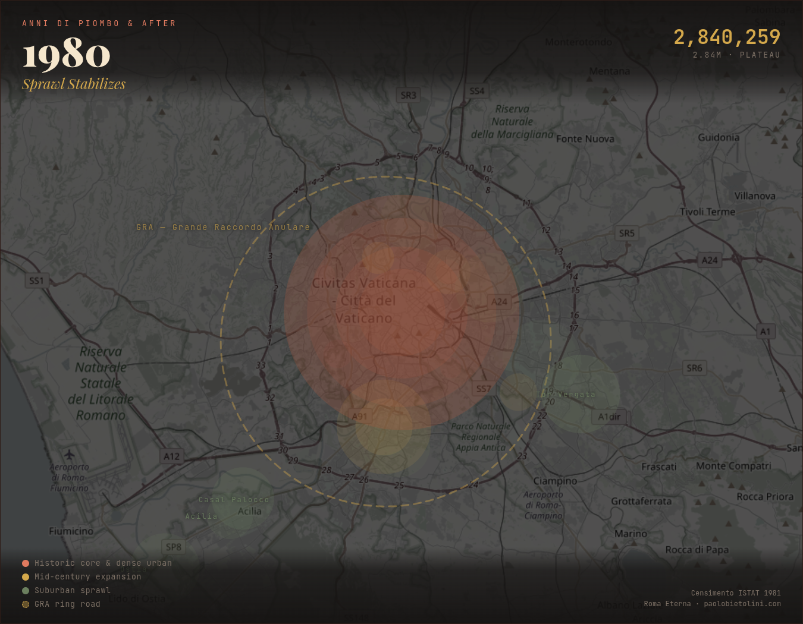
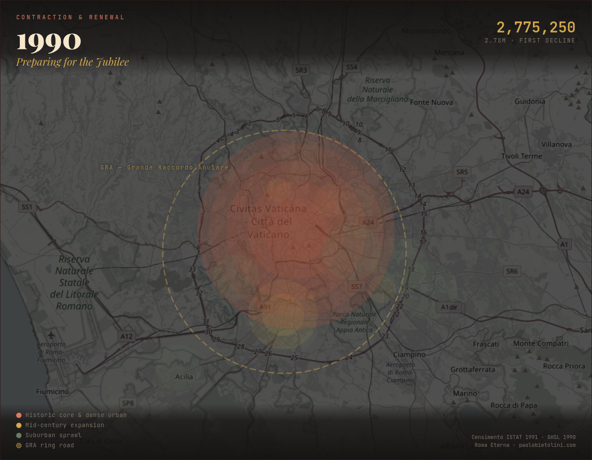
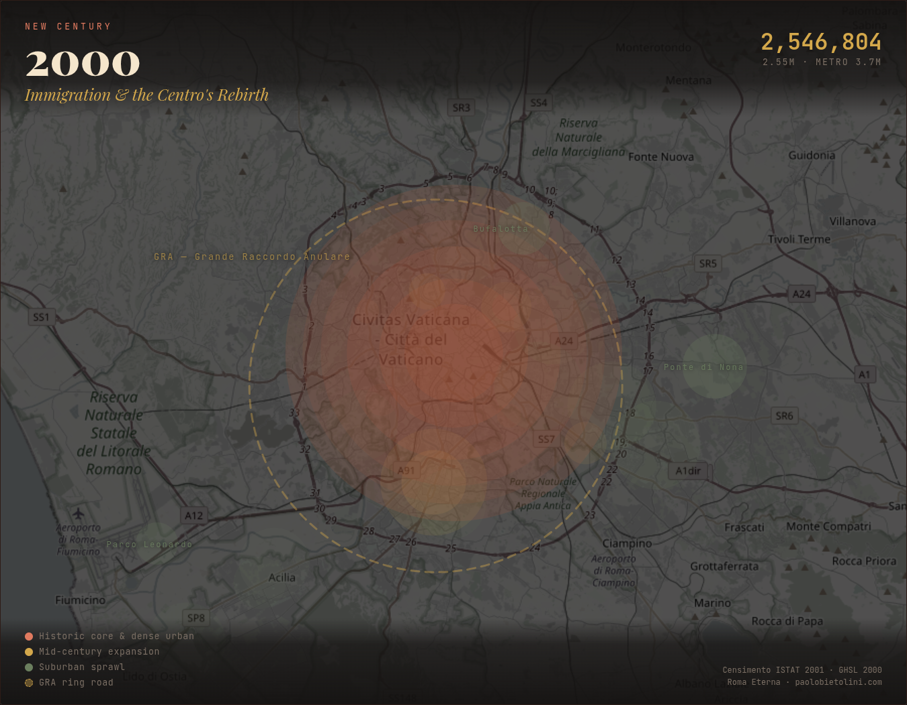
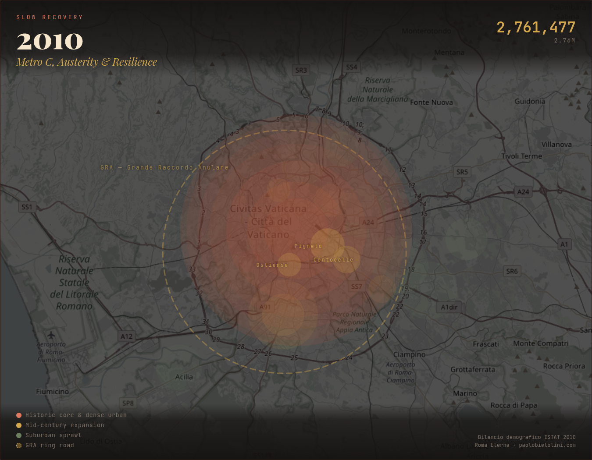
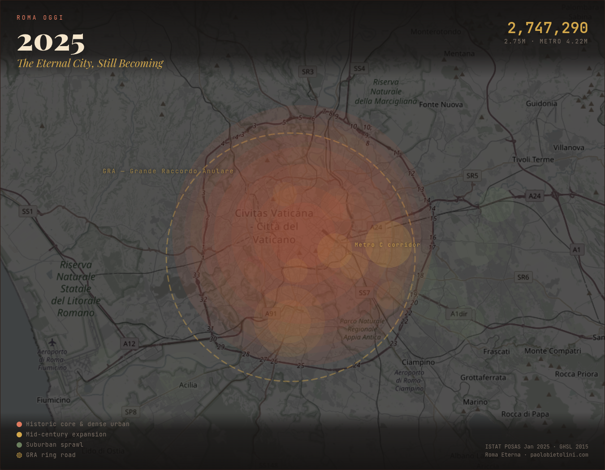
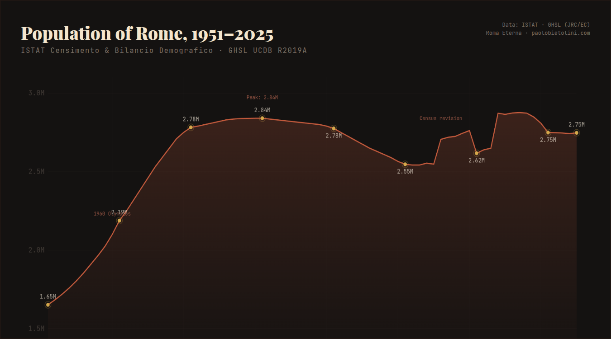

# Roma Eterna

**How the Eternal City transformed from a compact post-war capital into a sprawling metropolis of nearly 3 million.**

A scrollytelling map visualization showing Rome's urban expansion decade by decade, from 1950 to 2025.

## Gallery

| 1950 | 1960 | 1970 | 1980 |
|------|------|------|------|
|  |  |  |  |

| 1990 | 2000 | 2010 | 2025 |
|------|------|------|------|
|  |  |  |  |

## Key findings

- Rome's population surged from **1.65M** (1951) to a peak of **2.84M** (1981) during the *miracolo economico*
- The Grande Raccordo Anulare (GRA), built 1951-1970, became the city's de facto boundary
- After 1981, population declined for two decades as Romans moved to suburbs, hitting a low of **2.55M** in 2001
- Immigration and census revisions brought it back to **2.75M** by 2025
- GHSL satellite data shows built-up area grew from **218 km2** (1975) to **253 km2** (2015) --- a 16% increase even as population stagnated
- Average temperature rose from **15.3 C** (1990) to **16.3 C** (2014)

## How it works

A single self-contained HTML file (`index.html`) with:

- **Leaflet.js** map with dark-themed OpenStreetMap tiles
- **Scrollytelling** driven by `IntersectionObserver` --- as you scroll through narrative cards, the map updates to show each decade's urban footprint
- Colored circle overlays represent urban expansion zones (Centro Storico core, mid-century growth, GRA-era sprawl, post-GRA development)
- The GRA ring road shown as a dashed circle (10.5 km radius)
- Animated population counter and mini-chart with year-by-year data
- Mediterranean color palette: terracotta, ochre, olive, travertine on a dark background

No build step, no dependencies to install. Just open `index.html` in a browser.

## Data sources

| Source | What | Period |
|--------|------|--------|
| [ISTAT Censimento](https://www.istat.it/) | Decennial census population | 1951-2021 |
| [ISTAT Bilancio Demografico](https://demo.istat.it/) | Annual population estimates | 2002-2025 |
| [GHSL Urban Centre Database R2019A](https://ghsl.jrc.ec.europa.eu/ucdb2018visual.php) | Built-up area (km2), GDP, temperature, greenness (NDVI) | 1975-2015 |
| [OpenStreetMap](https://www.openstreetmap.org/) | Roma Capitale municipal boundary | 2024 |

### Data files

- `rome_population.parquet` --- annual population 1951-2025 with GHSL indicators (built-up area, GDP, temperature, NDVI)
- `rome_municipi.parquet` --- population by municipio (sub-municipal district), 2001 and 2011 systems
- `roma_boundary.geojson` --- Roma Capitale administrative boundary from OSM (relation 41313)

## License

Data: see individual source licenses (ISTAT: CC BY 3.0 IT, GHSL: CC BY 4.0, OSM: ODbL).
Visualization code: MIT.
